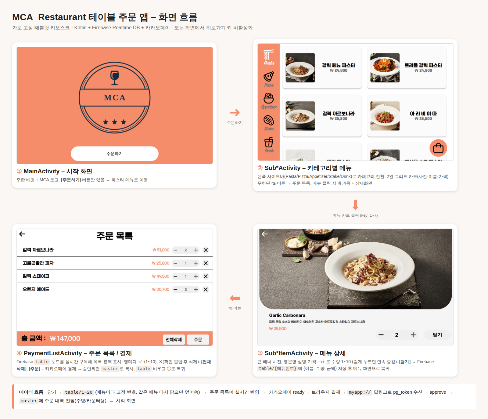
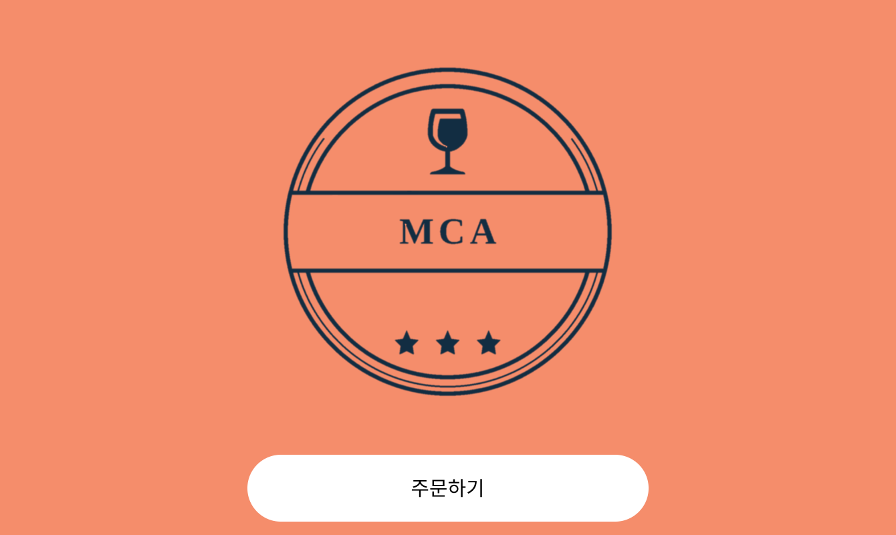
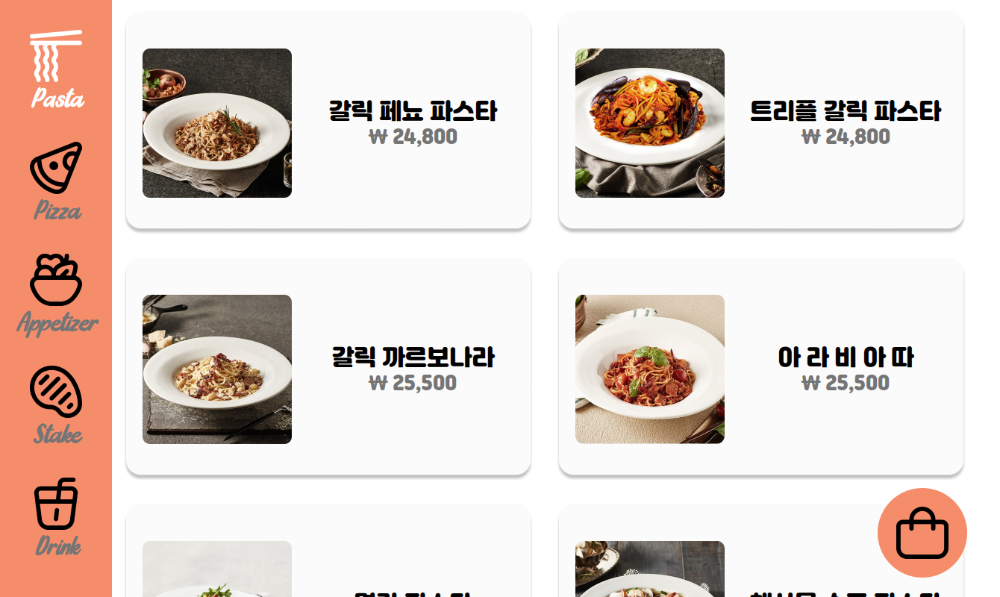
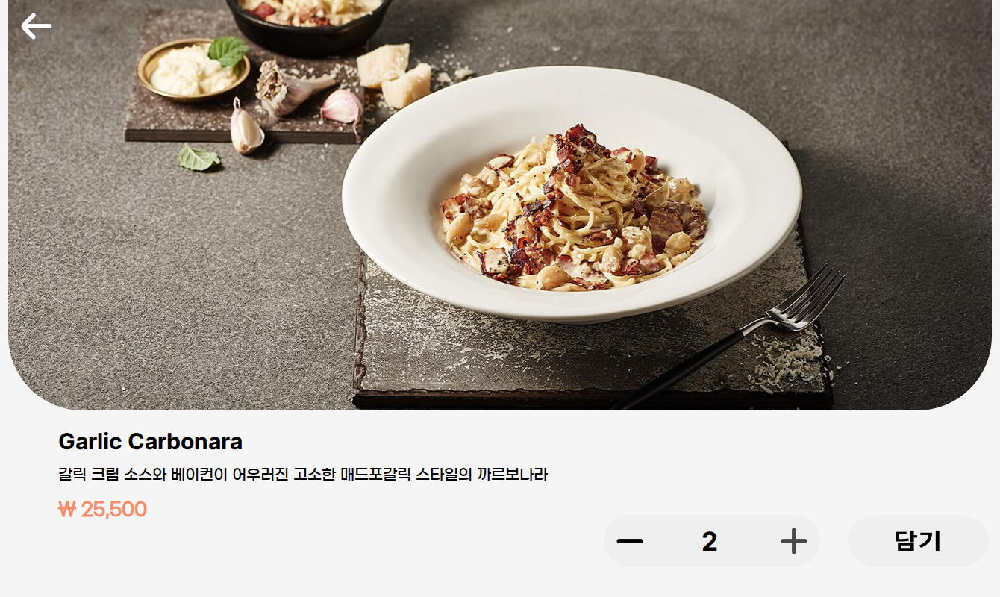
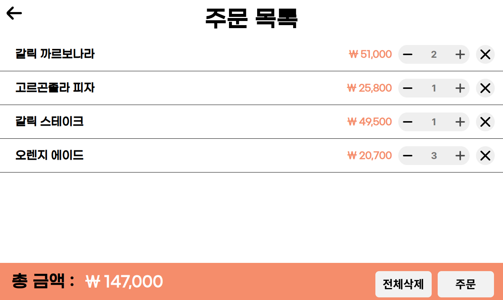

# MCA Restaurant – 테이블 주문 태블릿 앱

레스토랑 테이블에 두는 **가로형 Android 키오스크 앱**입니다.
손님은 카테고리별 메뉴를 보고 장바구니에 담은 뒤 **카카오페이**로 결제합니다.
장바구니와 주문 내역은 **Firebase Realtime Database**에 저장되고,
결제가 끝난 주문은 서빙 로봇 태블릿 앱 [MCA_Third_project](https://github.com/ChoIT97/MCA_Third_project)가 읽어서 서빙에 사용합니다.



> 화면 이미지는 레이아웃 XML과 저장소의 리소스로 재현한 것입니다. 실제 기기 화면과 조금 다를 수 있습니다.

---

## 화면 구성

| 시작 | 메뉴 목록 | 메뉴 상세 | 주문 목록 / 결제 |
|---|---|---|---|
|  |  |  |  |

1. **시작 화면** (`MainActivity`): MCA 로고와 [주문하기] 버튼이 있고, 버튼을 누르면 파스타 메뉴로 이동합니다.
2. **메뉴 화면** (`SubPastaActivity`, `SubPizzaActivity`, `SubAppetizerActivity`, `SubStakeActivity`, `SubDrinkActivity`)
   - 왼쪽 사이드바에서 카테고리를 전환하고, 가운데 2열 그리드에 메뉴 카드가 나옵니다.
   - 🛍 버튼을 누르면 주문 목록으로 이동합니다.
3. **메뉴 상세** (`Sub*ItemActivity`)
   - 사진, 설명, 가격과 함께 수량을 1~10 사이에서 고릅니다. +/-를 길게 누르면 연속으로 바뀝니다.
   - [담기]를 누르면 Firebase `table/{메뉴번호}`에 저장됩니다.
4. **주문 목록** (`PaymentListActivity`)
   - 장바구니를 실시간으로 보여주고, 수량 변경과 삭제, [전체삭제]를 할 수 있습니다.
   - [주문]을 누르면 카카오페이 결제가 진행되고, 승인되면 주문이 `master`로 옮겨진 뒤 시작 화면으로 돌아갑니다.

모든 화면에서 기기 뒤로가기 키는 막혀 있고, 버튼을 누르면 효과음이 납니다.

---

## 결제 흐름 (카카오페이 단건결제)

```
[주문] 버튼
  └─ kakaoPayReady()      POST /v1/payment/ready   → next_redirect_pc_url, tid
       └─ 브라우저에서 결제창 열기 + 1초마다 상태 조회 시작
  결제 완료 → approval_url(로컬 웹서버) → myapp:// 딥링크로 앱 복귀
  └─ onNewIntent()        pg_token 수신 (Activity 는 singleTop)
       └─ kakaoPayApprove()  POST /v1/payment/approve
            └─ table → master 복사, table 삭제, 시작 화면으로
```

- 테스트 가맹점 코드 `TC0ONETIME`을 사용합니다.
- `approval_url`, `fail_url`, `cancel_url`은 같은 Wi-Fi에 있는 PC 웹서버(`http://192.168.0.6:8080/`)를 가리킵니다. 이 페이지가 `myapp://` 스킴으로 앱을 다시 열어줘야 결제가 마무리됩니다.

---

## Firebase Realtime Database 구조

| 노드 | 내용 |
|---|---|
| `table/{메뉴번호}` | 현재 테이블의 장바구니. `{ meatMenu: 메뉴명, meatNumber: 수량, meatValue: 금액 }` |
| `master/{0..n}` | 결제가 끝난 주문 목록 (서빙 로봇 앱이 읽음) |

메뉴마다 번호가 고정되어 있어서, 같은 메뉴를 다시 담으면 수량이 더해지지 않고 새 값으로 덮어씁니다.

### 메뉴번호 · 가격

| 번호 | 카테고리 | 메뉴 (가격) |
|---|---|---|
| 1~7 | 파스타 | 갈릭 페뇨 파스타 24,800 · 트리플 갈릭 파스타 24,800 · 갈릭 까르보나라 25,500 · 아라비아따 25,500 · 명란 파스타 26,200 · 해산물 수프 파스타 26,200 · 랍스타 크림 파스타 27,500 |
| 8~12 | 피자 | 단호박 크림 피자 24,800 · 고르곤졸라 피자 25,800 · 갈릭 스노윙 피자 26,800 · 마르&부라타 피자 27,500 · 바질 부라타 피자 27,800 |
| 13~16 | 애피타이저 | 시저 샐러드 19,500 · 갈릭 타워샐러드 19,900 · 케일 샐러드 19,900 · 쉬림프 카슈엘라 25,900 |
| 17~20 | 스테이크 | 갈릭 스테이크 49,500 · 허브 스테이크 49,500 · 갈릭 허그 스테이크 49,900 · 본 스테이크 49,500 |
| 21~26 | 음료 | 오렌지·레몬·자몽 에이드 6,900 · 레드·화이트 와인 쿨러 6,900 · 사이다 4,500 |

메뉴나 가격을 바꾸려면 다음 세 곳을 함께 수정해야 합니다.
- 카테고리 화면의 `itemList`
- 상세 화면의 [담기] 처리
- `PaymentListAdapter`의 `selectPlusMinus`

---

## 프로젝트 구조

```
app/src/main/java/com/chocho/MCA_Restaurant/
├── MainActivity.kt              # 시작 화면
├── Sub{Pasta,Pizza,Appetizer,Stake,Drink}Activity.kt       # 카테고리별 메뉴 그리드
├── Sub{Pasta,Pizza,Appetizer,Stake,Drink}ItemActivity.kt   # 메뉴 상세 / 수량 선택 / 담기
├── SubActivityAdapter.kt        # 메뉴 카드 그리드 어댑터
├── DataClassSubActivity.kt      # 메뉴 카드 데이터 (사진, 이름, 가격)
├── PaymentListActivity.kt       # 주문 목록 + 카카오페이 결제
├── PaymentListAdapter.kt        # 주문 목록 한 줄 (+/-, 삭제)
├── FirebaseViewModel.kt         # 장바구니 LiveData
├── FirebaseActivityRepo.kt      # Firebase table 노드 구독
├── DataClassMeat.kt             # 장바구니 항목 (메뉴명, 수량, 금액)
├── TestKakopay.kt               # (미사용) 카카오페이 연동 실험용
└── TestWebView.kt               # (미사용) WebView 결제 실험용
```

## 기술 스택
- Kotlin, Android (compileSdk 33 / minSdk 21), 가로 고정 · 전체화면
- Firebase Realtime Database
- AndroidX ViewModel · LiveData, RecyclerView, ConstraintLayout
- OkHttp (카카오페이 REST API), SoundPool (효과음)

## 실행 방법
1. Android Studio에서 프로젝트를 엽니다.
2. `app/google-services.json`을 자신의 Firebase 프로젝트 설정 파일로 교체합니다.
3. `PaymentListActivity`에서 다음 두 가지를 자신의 값으로 바꿉니다.
   - 카카오페이 Admin 키(`admin`)
   - 결제 후 돌아올 주소(`approvalUrl` 등)
4. 결제를 끝까지 테스트하려면 `approvalUrl`의 웹서버가 `myapp://...?pg_token=...`으로 앱을 다시 열어줘야 합니다.

---

## 알려진 문제 / 주의 사항
- **카카오 Admin 키가 소스에 그대로 들어 있습니다.** (`PaymentListActivity`, `TestKakopay`) 저장소가 공개되어 있다면 키를 재발급하고, 결제 API 호출은 서버로 옮기는 것을 권장합니다.
- **결제 후 돌아오는 주소가 내부망 IP로 고정되어 있습니다.** 그래서 해당 네트워크 밖에서는 결제가 완료되지 않습니다.
- **상품명이 `"1번 테이블"`로, 부가세가 `200`으로 고정되어 있습니다.**
- **장바구니를 모두 지우면 주문 목록 화면의 LiveData가 갱신되지 않습니다.** `FirebaseActivityRepo`는 `table`이 비어 있을 때 값을 보내지 않기 때문입니다. 다만 전체삭제 후에는 메뉴 화면으로 이동하므로 실사용에서는 드러나지 않습니다.
